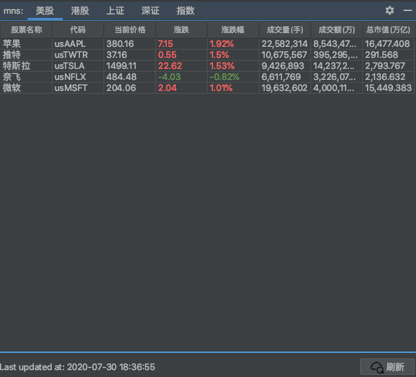
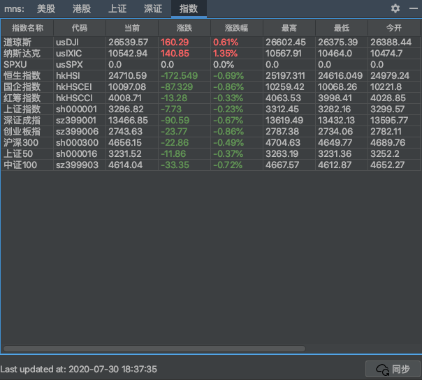
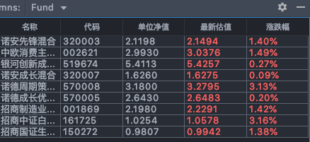
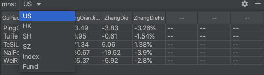
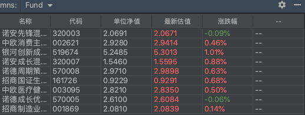

# mns: Money Never Sleeps!
IntelliJ IDEA平台插件. 支持查看股票实时行情. 支持美股, 港股, A股和基金.

# Installation:
* IntelliJ IDEA -> Preferences -> Plugins -> Install Plugin From Disk..., 从本项目中下载 `lib/mns-x.x.x.jar`文件并选中, 安装.
* IntelliJ IDEA -> Preferences -> Plugins -> Marketplace, type `mns`/`money`/`money never`/`money never sleeps` to search and install.

# Compilation:
打开 `Terminal` 窗口, 运行 `./gradlew build` 命令, 结束后你会发现 `libs/mns-x.x.x.jar` 文件的生成.

# Usage:

Settings:

US stocks:

Core indices:

Funds:

Stock Details:

Fund Query:

# Changes
* V1.0.0
  * 添加了设置窗口, 美股实时数据.
* V1.1.0
  * 添加了港股实时数据.
* V1.2.0
  * 添加了上证, 深证股票实时数据.
* V1.2.1
  * 格式化了成交额, 成交量, 总市值.
* V1.2.2
  * 新增了简洁模式.
* V1.4.0
  * 新增了核心指数.
* V1.4.1
  * 更新了 plugin.xml 以上传 Marketplace.
* V1.4.2
  * 跟随 IdeaIC 2020.2 更新. 
* V1.4.3
  * 激活了隐秘模式. 
* V1.5.0
  * 新增了基金数据. 
* V1.5.1
  * 添加了plugin icon. 
* V1.5.2
   * 代码优化, 以及 Android Studio 上面中文乱码的问题. 
* V1.5.3
   * 使用零宽断言解析jsonp, 并激活了简洁模式. 
* V1.6.0
   * 添加了股票详情窗口. 
* V1.7.1
   * 添加了基金和基金公司的搜索和基金的自动添加. 
* V1.7.2
    * bugs fixed and merge sh and sz. 
* V1.7.3
    * added ask&bid 5. 
* V1.7.4, 1.7.5
    * bugs fixed. 
  
# TODO
* **<b><s>基金</s></b>**
* **<b><s>股票盘口数据</s></b>**
* **<b><s>股票实时资金流向</s></b>**
* **<b>基金行情图</b>**
* **<b><s>查看基金公司</s></b>**
* **<b><s>搜索基金</s></b>**
* **<b>股价提醒功能</b>**
* **<b>创业版</b>**
* **<b>股价行情图</b>**
* **<b>总盈亏估算</b>**
* **<b>...</b>**

# Support
 Open-source is no easy job, for which I have to sacrifice my weekends and other non-working hours. 
 开源不易, 尤其是对于全职的开源爱好者. 需要占用不少下班以及周末时间. 
 If you think this plugin is meaningful, is worthy, you are welcome to support this project by following: 
 如果您觉着这个项目是值得做的, 是做的有意义的, 可以通过以下方式来表达支持:  

* [Watch/Star/Fork](https://github.com/bytebeats/mns) this project. [关注/标星/Fork](https://github.com/bytebeats/mns) 该项目.
* Share/Recommend this plugin(<b>mns</b>) to your friends/work mates. 向朋友或者同事推荐该插件.
* Highly rate [mns](https://plugins.jetbrains.com/plugin/14801-money-never-sleeps/) in [Marketplace](https://plugins.jetbrains.com/). 在应用市场对 [mns](https://plugins.jetbrains.com/plugin/14801-money-never-sleeps/) 进行评分
* Create [PR](https://github.com/bytebeats/mns/pulls) s. 提交 [PR](https://github.com/bytebeats/mns/pulls).
* Create [Issue](https://github.com/bytebeats/mns/issues) s. 反馈问题, 提供您的建议或者想法.
* If you love this plugin, you may donate for maintain this project and this plugin. 如果你喜欢这个插件, 可以考虑捐赠, 以持续地对该项目跟插件进行维护.

    Open Collective | 支付宝/Alipay | 微信/Wechat | PayPal
    -------------- | -------------- | -------------- | --------------
    <a href=https://opencollective.com/mns-collective>mns Collective</a> |  |  | <a href=https://www.paypal.me/bytesbeat>Donate</a>

 使用支付宝/微信支付捐赠后请留言或者通过邮件提供您的名字/昵称和网站，格式为： 
 名字/昵称 [<网站>][：留言]（网站与留言为可选部分，例子：bytebeats <github.com/bytebeats>：加油！） 
 您提供的名字、网站和捐赠总额将会被添加到捐赠者列表中。 
 邮箱地址：<a href="mailto:happychinapc@gmail.com?subject=mns捐赠&body=你做的工作很有意义, 加油!">happychinapc@gmail.com</a> 
 感谢您的支持！ 

# More plugins
* [Polyglot](https://github.com/bytebeats/polyglot) Translators
* [JsonMaster](https://github.com/bytebeats/JsonMaster)
* [kfiglet](https://github.com/bytebeats/kfiglet) Ascii Arts

# Contributors

# Donates
* <a href="mailto:vip-cyq@qq.com">小鱼</a>

## Stargazers over time

