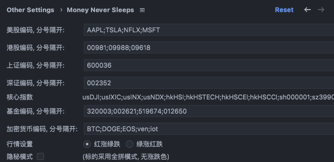
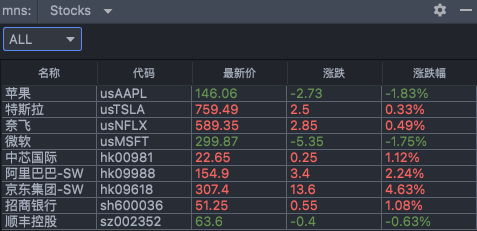
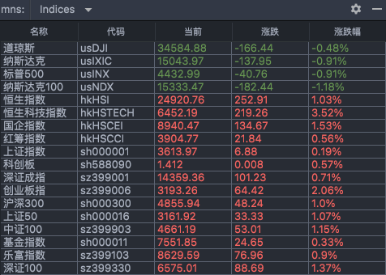
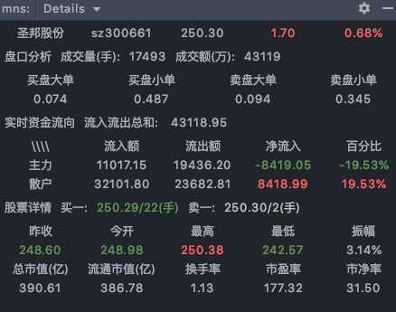
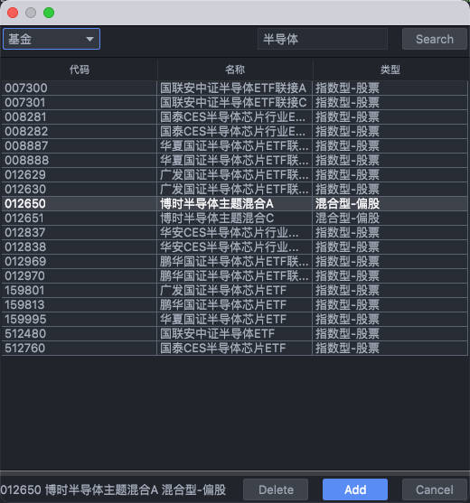

# mns: Money Never Sleeps!

IntelliJ IDEA平台插件. 支持查看股票实时行情. 支持<b>股票</b>, <b>基金</b>和<b>数字货币</b>. 其中股票包括<b>美股</b>, <b>港股</b>和 <b>A 股</b>.

## Notes
* Double left-click on item of indices or stocks, you'll see k-line charts poped-up; Single right-click, you'll see stock chart type options. 双击鼠标左键, 你会看到股票行情图; 单击鼠标右键, 你会看到股票行情图分类;
* Double left-click on item of funds, you'll see k-line charts poped-up; Single right-click, you'll see fund chart type options. 基金点击操作如上.
* In Setting page, symbols should be separated by comma/blanket/colon in English; 股票/基金/加密货币编码请用英语的逗号, 冒号或者空格分隔. 不要用汉字或者其它语言的标识符号.
* symbols of supported Crypto currencies, please check in [Here](https://finance.sina.com.cn/blockchain/hq.shtml). 数字货币代码请从 [这里](https://finance.sina.com.cn/blockchain/hq.shtml) 查找.
* Stock service is supported by Tencent. Please check symbols [Here](https://stockapp.finance.qq.com/mstats/). 股票代码请从查找 [这里](https://stockapp.finance.qq.com/mstats/).
* Fund service is supported by TianTian funds. Please check fund symbols [Here](https://fund.eastmoney.com). 基金代码请从 [这里](https://fund.eastmoney.com) 查找

## Installation:
* `IntelliJ IDEA` -> `Preferences` -> `Plugins` -> `Marketplace`, type `mns`/`money`/`money never`/`money never sleeps` to search and install.

## Questions
* Where to add symbols?
  * `IntelliJ IDEA` -> `Preferences` -> `Other Settings` -> `Money Never Sleeps`
* How to check fund k-line charts?
  * double left-click or sing right-click on fund list, you'll see popup windows.

## Compilation
* `File` -> `Project Structure` -> `Project Settings` -> `Artifacts` -> `+` -> `Jar` -> `From modules with dependencies`
* In Dialog <b>Create JAR from Modules</b>, select `mns.main` for <b>Module</b>, select `extract to the target JAR` for <b>Jar files from libraries</b>, then click <b>OK</b>.
* Then click `+` icon in <b>Output Layout</b> and select `module sources`, and then click `Apply`/`OK`
* Last step, how to <b>Build Artifacts</b>
  * <b>Build</b> -> <b>Build Artifacts</b> -> `mns:main:jar` -> <b>Build/Rebuild/Clean</b>
  * Then you'll see `mns.main.jar` in `out/artifacts/mns_main_jar/`

## Usage:

mns is IntelliJ IDEA plugin, which means all IDEs who base on IntelliJ supports mns, namely <b>IntelliJ/Android Studio/PyCharm/CLion/GoLand/AppCode/Rider/WebStorm</b> and so on.

mns是 IntelliJ 平台插件, 所有基于 IntelliJ 平台的 IDE 都会支持 mns 插件. 诸如 <b>IntelliJ/Android Studio/PyCharm/CLion/GoLand/AppCode/Rider/WebStorm</b> 等等.

Settings:

Stocks:

Indices:

Funds:

Digital Currencies:

Stock Details:

Fund Query:

## Changes
* V1.0.0
  * 添加了设置窗口, 美股实时数据.
* V1.1.0
  * 添加了港股实时数据.
* V1.2.0
  * 添加了上证, 深证股票实时数据.
* V1.2.1
  * 格式化了成交额, 成交量, 总市值.
* V1.2.2
  * 新增了简洁模式.
* V1.4.0
  * 新增了核心指数.
* V1.4.1
  * 更新了 plugin.xml 以上传 Marketplace.
* V1.4.2
  * 跟随 IdeaIC 2020.2 更新.
* V1.4.3
  * 激活了隐秘模式.
* V1.5.0
  * 新增了基金数据.
* V1.5.1
  * 添加了plugin icon.
* V1.5.2
   * 代码优化, 以及 Android Studio 上面中文乱码的问题.
* V1.5.3
   * 使用零宽断言解析jsonp, 并激活了简洁模式.
* V1.6.0
   * 添加了股票详情窗口.
* V1.7.1
   * 添加了基金和基金公司的搜索和基金的自动添加.
* V1.7.2
    * bugs fixed and merge sh and sz.
* V1.7.3
    * added ask&bid 5.
* V1.7.4, 1.7.5
    * bugs fixed.
* V1.8.0 merge stock windows for more space for klines.
* V1.8.1 crypto currency window.
* V1.8.2 customize refresh frequency.
* V1.8.3 net worth chart of fund. 
* V1.8.4 k-line chart of stock. 

## TODO
* **<b><s>基金</s></b>**
* **<b><s>股票盘口数据</s></b>**
* **<b><s>股票实时资金流向</s></b>**
* **<b><s>基金行情图</s></b>**
* **<b><s>查看基金公司</s></b>**
* **<b><s>搜索基金</s></b>**
* **<b>股价提醒功能</b>**
* **<b><s>创业版</s></b>**
* **<b><s>股价行情图</s></b>**
* **<b>总盈亏估算</b>**
* **<b>北交所</b>**
* **<b>股票 API 支持腾讯和新浪选项</b>**
* **<b>代理支持</b>**
* **<b><s>数字货币</s></b>**
* **<b>...</b>**

## Support
 Open-source is no easy job, for which I have to sacrifice my weekends and other non-working hours. 
 开源不易, 尤其是对于全职的开源爱好者. 需要占用不少下班以及周末时间. 
 If you think this plugin is meaningful, is worthy, you are welcome to support this project by following: 
 如果您觉着这个项目是值得做的, 是做的有意义的, 可以通过以下方式来表达支持:  

* [Watch/Star/Fork](https://github.com/bytebeats/mns) this project. [关注/标星/Fork](https://github.com/bytebeats/mns) 该项目.
* Share/Recommend this plugin(<b>mns</b>) to your friends/work mates. 向朋友或者同事推荐该插件.
* Highly rate [mns](https://plugins.jetbrains.com/plugin/14801-money-never-sleeps/) in [Marketplace](https://plugins.jetbrains.com/). 在应用市场对 [mns](https://plugins.jetbrains.com/plugin/14801-money-never-sleeps/) 进行评分
* Create [PR](https://github.com/bytebeats/mns/pulls) s. 提交 [PR](https://github.com/bytebeats/mns/pulls).
* Create [Issue](https://github.com/bytebeats/mns/issues) s. 反馈问题, 提供您的建议或者想法.
* If you love this plugin, you may donate for maintain this project and this plugin. 如果你喜欢这个插件, 可以考虑捐赠, 以持续地对该项目跟插件进行维护.

    Open Collective | 支付宝/Alipay | 微信/Wechat | PayPal
    -------------- | -------------- | -------------- | --------------
    <a href=https://opencollective.com/mns-collective>mns Collective</a> |  |  | <a href=https://www.paypal.me/bytesbeat>Donate</a>

 使用支付宝/微信支付捐赠后请留言或者通过邮件提供您的名字/昵称和网站，格式为： 
 名字/昵称 [<网站>][：留言]（网站与留言为可选部分，例子：bytebeats <github.com/bytebeats>：加油！） 
 您提供的名字、网站和捐赠总额将会被添加到捐赠者列表中。 
 邮箱地址：<a href="mailto:happychinapc@gmail.com?subject=mns捐赠&body=你做的工作很有意义, 加油!">happychinapc@gmail.com</a> 
 感谢您的支持！ 

## More plugins
* [Polyglot](https://github.com/bytebeats/polyglot) Translators
* [JsonMaster](https://github.com/bytebeats/JsonMaster)
* [kfiglet](https://github.com/bytebeats/kfiglet) Ascii Arts

## Donates
* <a href="mailto:vip-cyq@qq.com">小鱼</a>

## Stargazers over time

## Github Stars Sparklines

## Contributors

## MIT License

    Copyright (c) 2021 Chen Pan

    Permission is hereby granted, free of charge, to any person obtaining a copy
    of this software and associated documentation files (the "Software"), to deal
    in the Software without restriction, including without limitation the rights
    to use, copy, modify, merge, publish, distribute, sublicense, and/or sell
    copies of the Software, and to permit persons to whom the Software is
    furnished to do so, subject to the following conditions:

    The above copyright notice and this permission notice shall be included in all
    copies or substantial portions of the Software.

    THE SOFTWARE IS PROVIDED "AS IS", WITHOUT WARRANTY OF ANY KIND, EXPRESS OR
    IMPLIED, INCLUDING BUT NOT LIMITED TO THE WARRANTIES OF MERCHANTABILITY,
    FITNESS FOR A PARTICULAR PURPOSE AND NONINFRINGEMENT. IN NO EVENT SHALL THE
    AUTHORS OR COPYRIGHT HOLDERS BE LIABLE FOR ANY CLAIM, DAMAGES OR OTHER
    LIABILITY, WHETHER IN AN ACTION OF CONTRACT, TORT OR OTHERWISE, ARISING FROM,
    OUT OF OR IN CONNECTION WITH THE SOFTWARE OR THE USE OR OTHER DEALINGS IN THE
    SOFTWARE.

